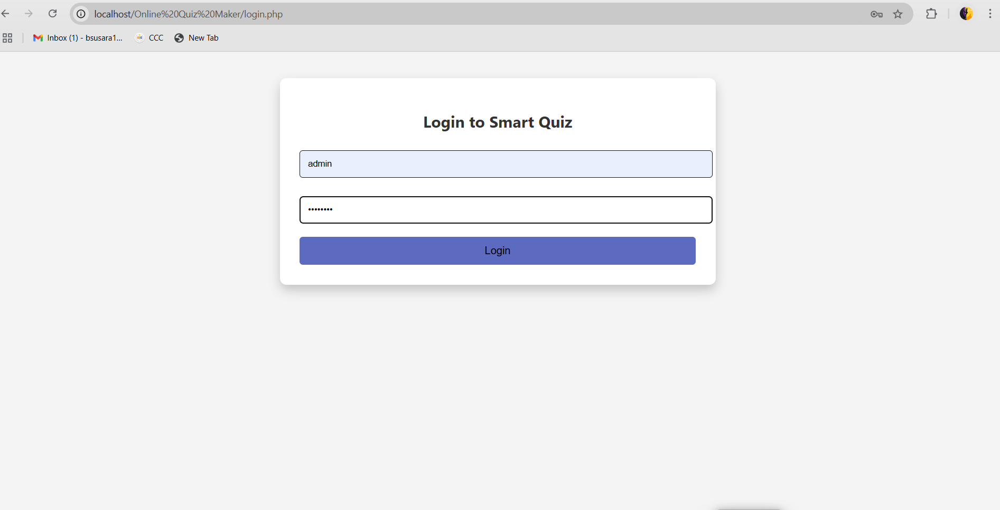
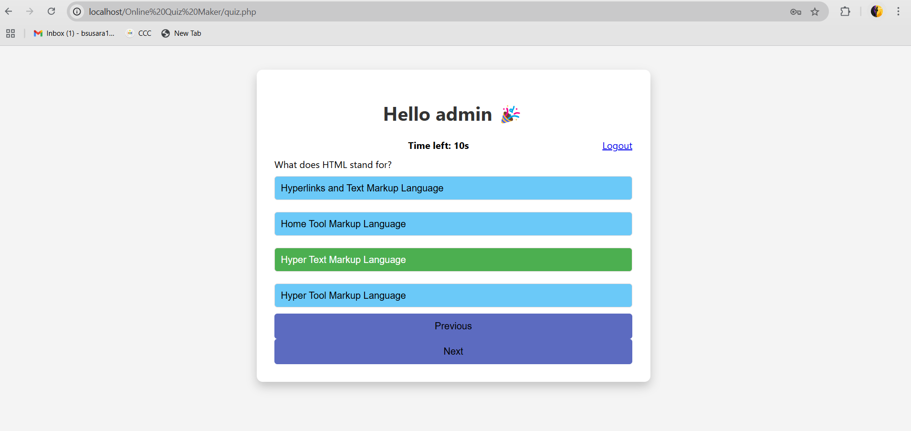
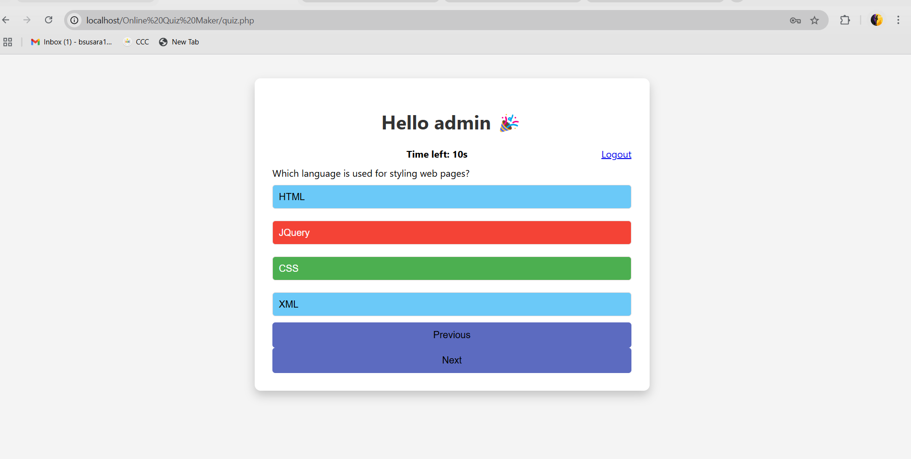
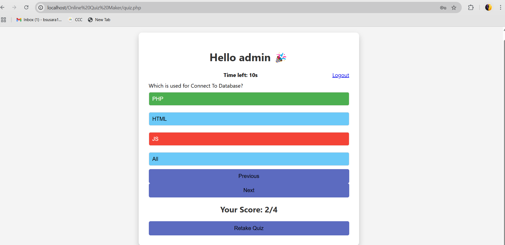

# Online Quiz Maker

## Task Objective
The objective of this project is to build an **interactive online quiz platform** where users can **log in, take quizzes**, and **view their results**.  
Only valid credentials (`admin`/`admin123`) allow access to the quiz platform.

This project is developed as a part of the **Web Application Development**.

## Features

- 🔐 **User Authentication**: Only authorized users can log in.
- 📝 **Quiz Attempting**: Users can answer multiple-choice questions.
- 📈 **Score Calculation**: Displays the user's score after submitting the quiz.
- 📊 **Analytics**: Basic tracking of quiz performance.
- 🎨 **Responsive and Clean UI**.

## Tech Stack Used

- **Frontend**: HTML, CSS, JavaScript
- **Backend**: PHP
- **Database**: MySQL (via XAMPP)
- **Hosting (Local)**: XAMPP server

## Steps to Run the Project

1. Install **XAMPP** on your machine if not installed.
2. Copy the project folder (`Online Quiz Maker`) into the `htdocs` directory inside XAMPP installation.
3. Start **Apache** and **MySQL** services in XAMPP.
4. Create a **Database** named `quizapp` in **phpMyAdmin**.
5. Import the `create_users_table.sql` file into the `quizapp` database to create necessary tables and insert default credentials.
6. Open your browser and visit:  http://localhost/Online%20Quiz%20Maker/login.php
7. Login with:
   ## 👤 User Login

| Username | Password |
|:--------:|:--------:|
| **admin** | **admin123** |

✅ **Only the user with these credentials can **login and access** the quiz.**

8. Attempt the quiz and view your results!
   

## Screenshots

###  Login Page

### Quiz Page

### Result Page

## Additional Information

- Make sure you have placed your project in the correct XAMPP `htdocs` folder.
- If the login does not work, ensure the database connection is correct and that the `users` table exists.
- The default credentials for login are hardcoded for testing:
  Username: admin Password: admin123

  

## Author

Bhogapurapu Susmitha

